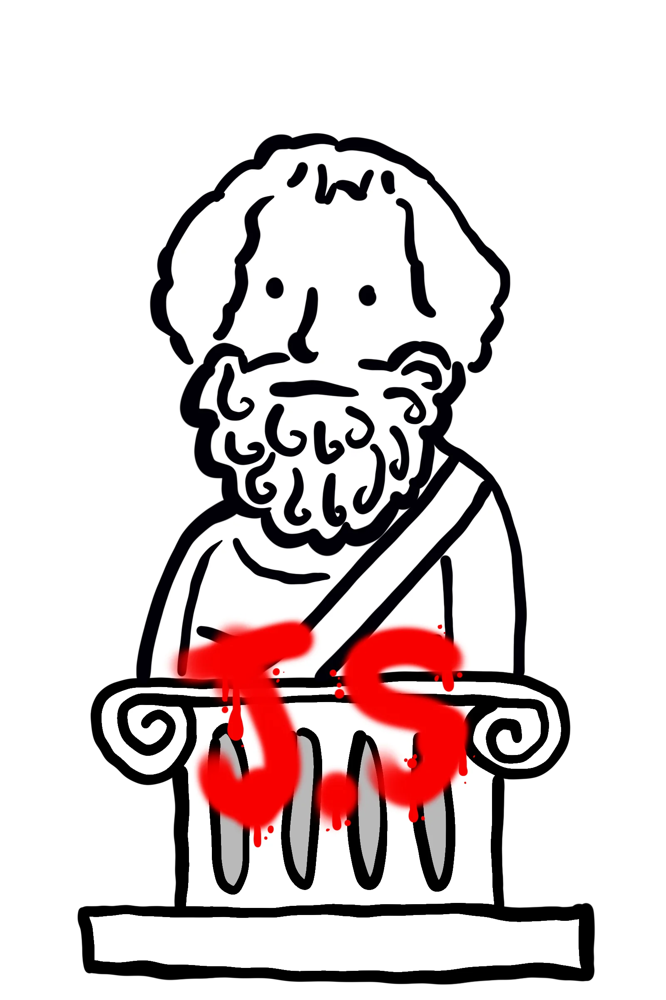

# Jeremy's Personal Website

# Dear ~~Diary~~

## This is a journal, not a diary

<table>
  <tr>
    <td width="70%">
      <p>
        Dear Internet Diary, today I finally stuffed my whole personality into a
        single website. It has projects I worked on, things I like, and probably
        a few easter eggs because I can't help myself. The vibe is corkboard-meets-
        art-museum-meets-chaotic-notes-from-my-brain. If you get lost, just follow
        the doodles. If you see a goose, it is probably my fault.
      </p>
    </td>
    <td width="30%" align="right">
      
    </td>
  </tr>
</table>

<table>
  <tr>
    <td width="30%" align="left">
      
    </td>
    <td width="70%">
      <p>
        The website is built to feel like flipping through a sketchy, messy,
        and slightly dramatic notebook. It is a living page, so I keep adding
        new projects, updates, and tiny visual surprises. If you are here to
        peek at my work, welcome. If you are here to judge my taste in fonts,
        please be gentle.
      </p>
    </td>
  </tr>
</table>

## Run It Locally

```bash
npm install
npm run dev
```

Open [http://localhost:3000](http://localhost:3000) to see it in action.

## Built With

- Next.js
- React
- CSS (for the weird fun stuff)
