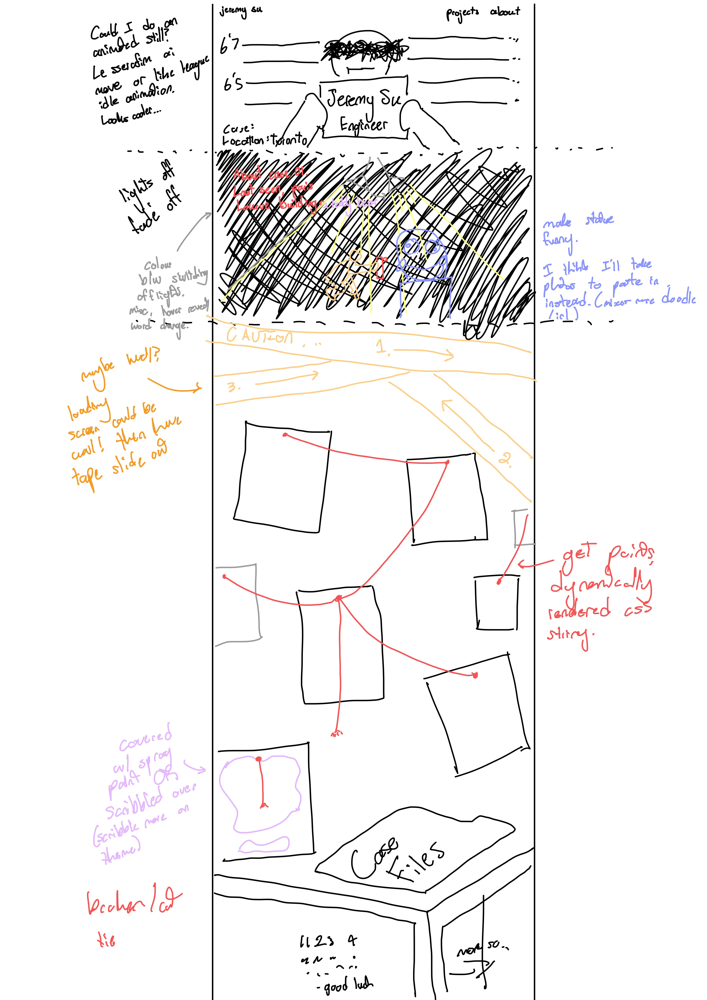
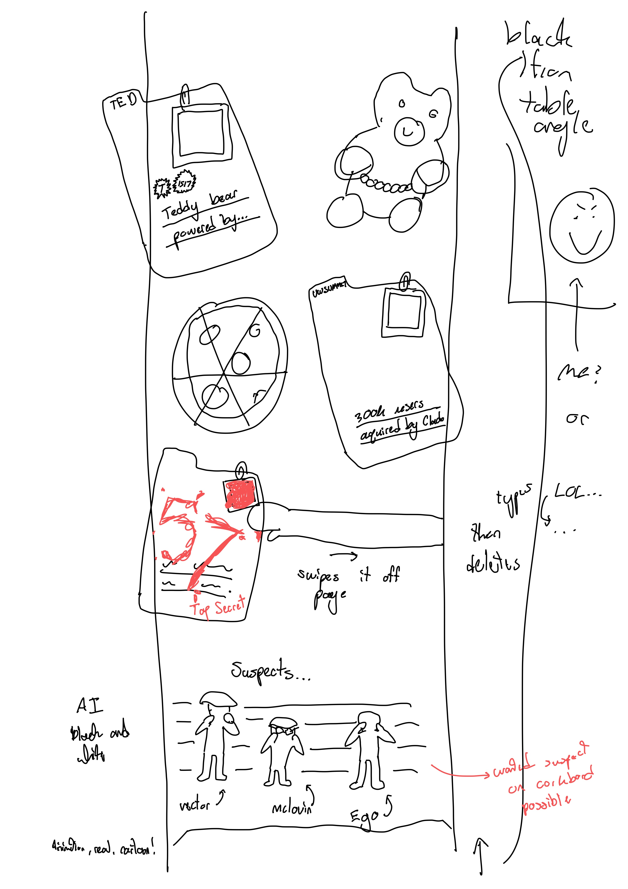
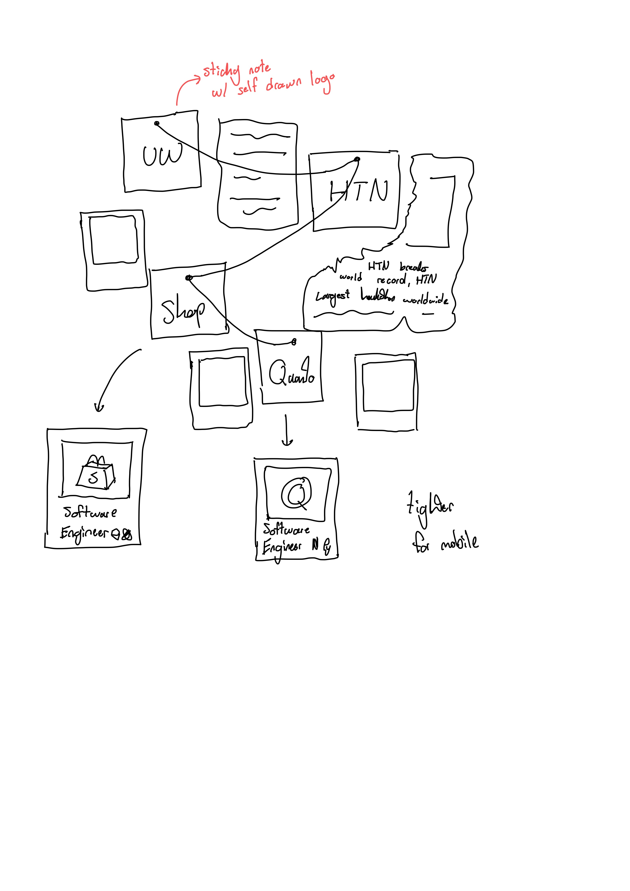
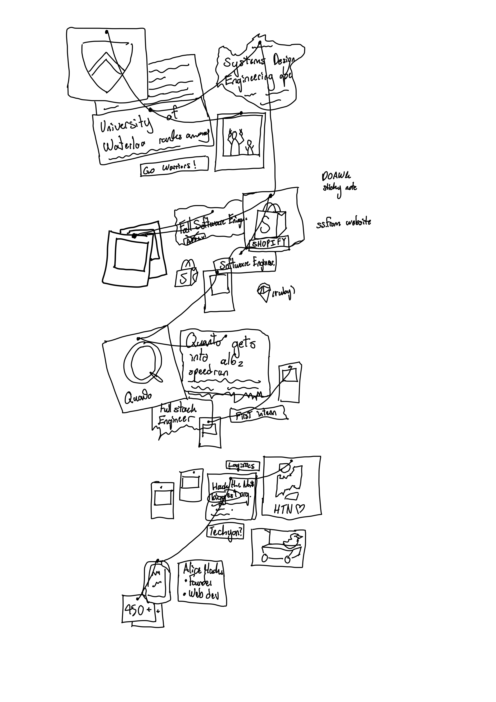

## ~~Dear Diary~~
# First of all, let me get something straight: This is a README, not a diary

<table>
  <tr>
    <td width="70%">
      

        This is my first ever personal portfolio! (Mostly because I get halfway through making one before I start hating it.)

  How I see it, you can do anything with a website—make it super simple and get the content right in front of people's faces, or go all out with animations and design with a crazy   polish. But I decided to do NEITHER and now here we are. The theming is a full investigation case on myself with the crime here being that this website is absolutely buns when resizing. 
      

    </td>
    <td width="30%" align="right">
      
    </td>
  </tr>
</table>

## Website Sketches

<table>
  <tr>
    <td align="center">
      
    </td>
    <td align="center">
      
    </td>
  </tr>
  <tr>
    <td align="center">
      
    </td>
    <td align="center">
      
    </td>
  </tr>
</table>

<table>
  <tr>
    <td width="30%" align="left">
      
    </td>
    <td width="70%">
      

        While making this website though.... something was off... almost like the code kept changing itself into these weird cryptic messages. Ever since I made this repo, files have been going missing left and right. I even began to see random comments and console logs appear. I deleted as many as I could to the best of my ability and hopefully thats the end of that. 
      

    </td>
  </tr>
</table>
